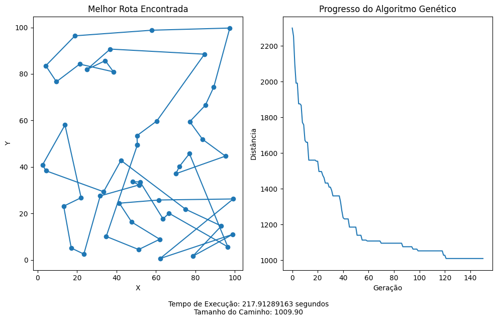

# Algoritmo Genético para Otimização de Rotas com IA e Machine Learning

Este projeto implementa um **Algoritmo Genético**, técnica de Inteligência Artificial e Machine Learning, para resolver problemas de otimização de rotas (semelhante ao Problema do Caixeiro Viajante). A aplicação gera conjuntos de pontos com distribuições uniforme ou circular, evolui populações de rotas e salva gráficos do progresso e da melhor solução.

## Funcionalidades

* Geração de pontos aleatórios:

  * Distribuição uniforme
  * Distribuição circular
* Implementação completa de Algoritmo Genético:

  * Seleção por torneio
  * Crossover por ordenamento de subtour
  * Mutação por troca de genes
* Cálculo de fitness baseado na distância total da rota
* Visualização:

  * Gráfico da melhor rota
  * Gráfico da evolução da distância ao longo das gerações
* Salvamento automático de gráficos com nomes incrementais e informações de tempo de execução

## Tecnologias

* Python 3.7+
* Bibliotecas:

  * `numpy` (cálculo numérico)
  * `matplotlib` (visualização)
  * `random`, `os`, `time` (suporte)

## Pré-requisitos

* Python 3.7 ou superior
* `numpy` e `matplotlib` instalados:

```bash
pip install numpy matplotlib
```

## Instalação e Execução

1. Clone o repositório e navegue até a pasta do projeto:

```bash
git clone https://github.com/enzoconsulo/Python.IA-OtimizacaoRotas.git
cd Python.IA-OtimizacaoRotas
```


## Estrutura de Arquivos

/

── genetic.py         # Implementação do Algoritmo Genético
── distribuida/       # Imagem gerada com pontos e resultados para distribuição uniforme
── circular/          # Imagem gerada com pontos e resultados para distribuição circular
 ─ README.md          # Documentação do projeto


## Exemplos

A seguir, alguns exemplos de gráficos gerados automaticamente pelo Algoritmo Genético:

***Distribuição Circular**:


*Gráfico da melhor rota para pontos dispostos em círculo e evolução da distância ao longo das gerações.*

***Distribuição Uniforme**:



*Gráfico da melhor rota para pontos distribuídos uniformemente em um espaço 2D e progresso do algoritmo.*
